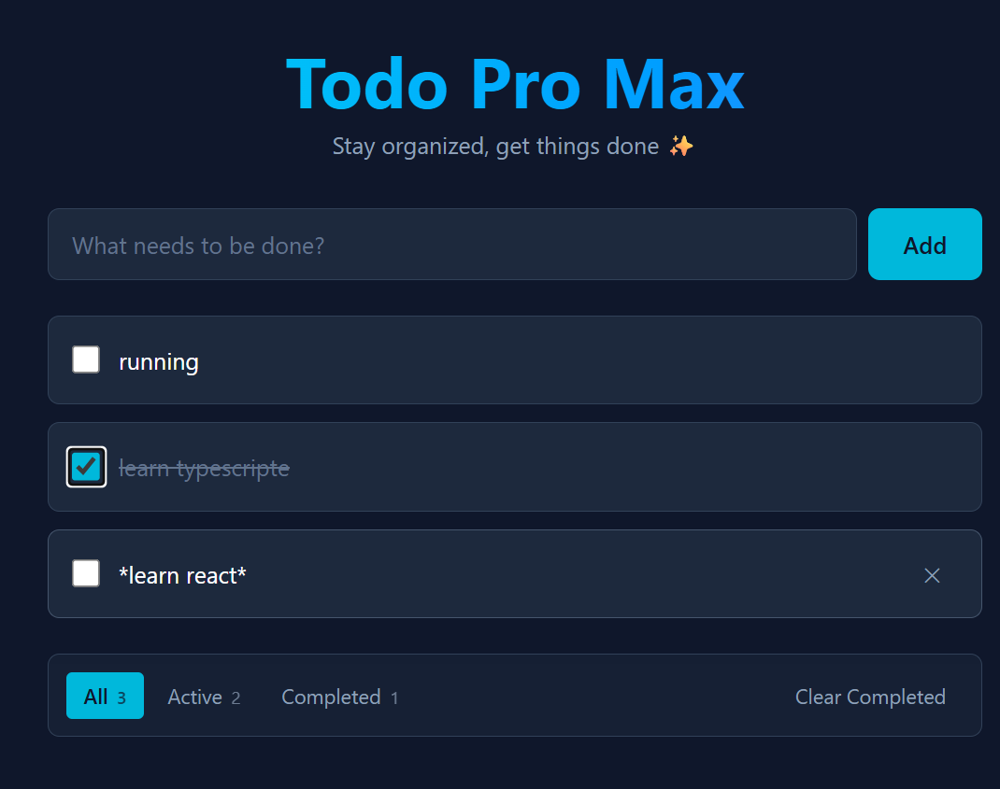

# 🚀 Todo Pro Max

A feature-rich Todo application built with React and Tailwind CSS. Stay organized and get things done with a clean, modern interface.

🔗 🔗 **[Live Demo](https://todo-react-app-mohsen.vercel.app)**


## ✨ Features

- ➕ **Add todos** — Quickly add new tasks
- ✅ **Toggle completion** — Mark tasks as done with a click
- ✏️ **Inline edit** — Double-click any todo to edit it (Enter to save, Escape to cancel)
- 🗑️ **Delete** — Remove individual todos
- 🔍 **Filter** — View all, active, or completed todos
- 🧹 **Clear completed** — Remove all completed todos at once
- 💾 **Persistent storage** — Todos are saved in localStorage
- 📱 **Responsive design** — Works on desktop, tablet, and mobile

## 🛠️ Tech Stack

- **React 19** — UI library
- **Vite** — Build tool and dev server
- **Tailwind CSS v4** — Utility-first CSS framework
- **JavaScript (ES6+)** — Programming language
- **localStorage** — Client-side persistence

## 🎯 What I Learned

This project helped me practice and solidify:

- **React Hooks** — `useState` for local state, `useEffect` for side effects
- **Props & Component Composition** — Passing data and callbacks between components
- **State Colocation** — Keeping state at the lowest component that needs it
- **Immutable Updates** — Using `map`, `filter`, and spread operator to update state correctly
- **Controlled Components** — Managing form inputs with React state
- **Conditional Rendering** — Showing different UI based on state
- **localStorage Integration** — Persisting data between sessions
- **Event Handling** — `onClick`, `onDoubleClick`, `onKeyDown`, `onChange`, `onBlur`

## 📦 Installation

```bash
# Clone the repository
git clone https://github.com/mohsen-goli/todo-react-app.git

# Navigate into the project
cd todo-react-app

# Install dependencies
npm install

# Start the development server
npm run dev
